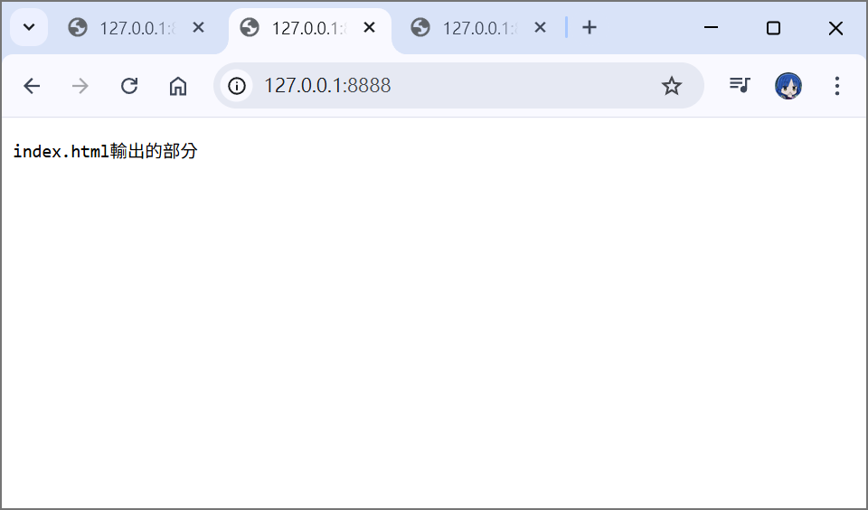
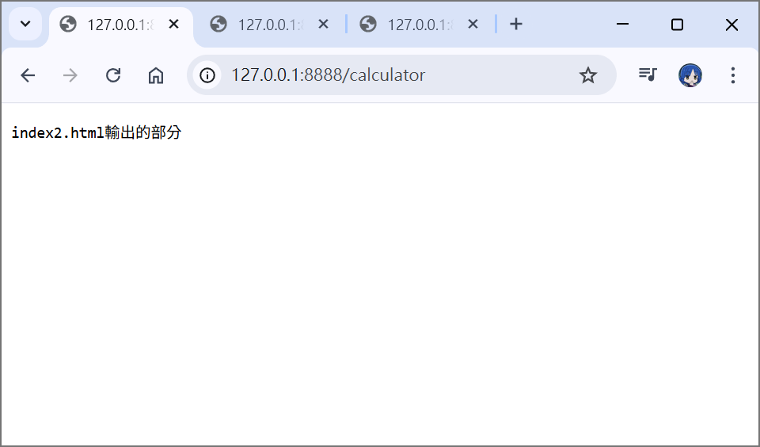
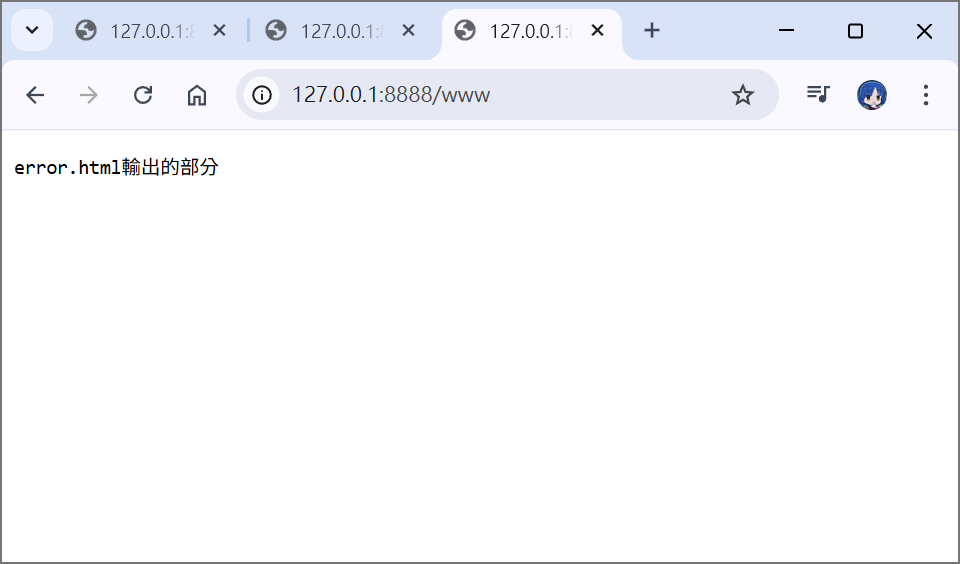
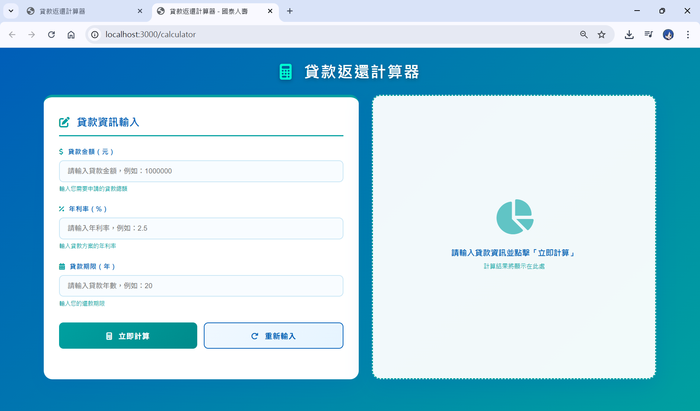

# 第2次隨堂題目-隨堂-QZ2
>
>學號：112111106
><br />
>姓名：楊于瑩
>

本份文件包含以下主題：(至少需下面兩項，若是有多者可以自行新增)
- [x] 說明內容

## 說明程式與內容

開始寫說明，該說明需說明想法，
並於之後再對上述想法的每一部分將程式進一步進行展現，
若需引用程式區則使用下面方法，
若為.cs檔內程式除了於敘述中需註明檔案名稱外，
還需使用語法` ```語言種類 程式碼 ``` `，其中語言種類若是要用python則使用py，java則使用java，C/C++則使用cpp，
下段程式碼為語言種類選擇csharp使用後結果：

```csharp
public void mt_getResult(){
    ...
}
```

若要於內文中標示部分網頁檔，則使用以下標籤` ```html 程式碼 ``` `，
下段程式碼則為使用後結果：

```html
<%@ Page Language="C#" AutoEventWireup="true" ...>

<!DOCTYPE html>

<html xmlns="http://www.w3.org/1999/xhtml">
<head runat="server">
<meta http-equiv="Content-Type" ...>
    <title></title>
</head>
<body>
    <form id="form1" runat="server">
        <div>
        </div>
    </form>
</body>
</html>
```
更多markdown方法可參閱[https://ithelp.ithome.com.tw/articles/10203758](https://ithelp.ithome.com.tw/articles/10203758)

請在撰寫"說明程式與內容"該塊內容，請把原該塊內上述敘述刪除，該塊上述內容只是用來指引該怎麼撰寫內容。

1. a.

Ans: 


1. b.

Ans:

<!-- 請撰寫時，最後一句話再寫一次 -->


1. c.

Ans:

<!--  請撰寫時，第一句話再寫一次  -->

2. a.

Ans:
***輸出結果***<br>
**輸入【/】**<br>
<br>
**輸入【/calculator】**<br>
<br>
**輸入其他**<br>
<br>
***程式碼***<br>
```js
  // 請寫 switch完成各個收到不同的請求以及輸出不同的回應字串 (使用 switch)
  switch (url) {
    case '/':
      answer = 'index.html輸出的部分'; 
      break;
    case '/calculator':
      answer = 'index2.html輸出的部分';
      break;
    default:
      answer = 'error.html輸出的部分';  
  }
```
**解釋:**
通過switch方法進行路由，判定如果請求中的url為【/】answer(也就是輸出畫面字串)為index.html輸出的部分，同理如果請求為【/calculator】，answer就為index2.html輸出的部分，都不以上兩種的話，則輸出error.html輸出的部分。


<!--  請撰寫時，第一句話再寫一次  -->

2. b.

Ans:***輸出畫面結果***<br>
**輸入【/】**<br>

**輸入【/calculator】**<br>

***程式碼***
```js
  // Switch根據不同路由要寫的部分
  switch (req.url) {
    case '/':
      filePath = '/index.ejs';
      break;
    case '/calculator':
      filePath = '/index2.ejs';
      break;
    default:
      break;
  }

if (req.url.endsWith('.css') || req.url.endsWith('.js') || req.url.endsWith('.png')) {
  fileOtherFile = req.url;             // 靜態資源路徑
}
```

**解釋:**
這題一樣是用switch來進行路由，不同的是，這次要連接的不是單純的，而是網頁頁面，所以不能使用answer，要使用filePath來作為ejs檔的路徑進行。
而下面if字串，則是靜態資源路徑，是為了讓網頁css設計都可以一起呈現出來而打的。


<!--  請撰寫時，第一句話再寫一次  -->

2. c.

Ans:***輸出畫面***

***程式碼***
```js
        fs.readFile('./index3.ejs', 'utf8', (ejsErr, template) => {
          if (ejsErr) {  // 如果 404 檔也讀不到
            res.writeHead(500, { 'Content-Type': 'text/html; charset=utf-8' });
            res.end('伺服器錯誤：找不到 404 頁面');
            return;
          }
          const html = ejs.render(template);
          res.writeHead(404, { 'Content-Type': 'text/html; charset=utf-8' });
          res.end(html);
          });
```
**解釋:**
當靜態資源載入失敗時，例如：請求不存在的文件或網址，不直接回傳錯誤訊息，而是顯示index3.ejs。

<!--  請撰寫時，第一句話和最後一句再寫一次  -->

2. d.

Ans:


